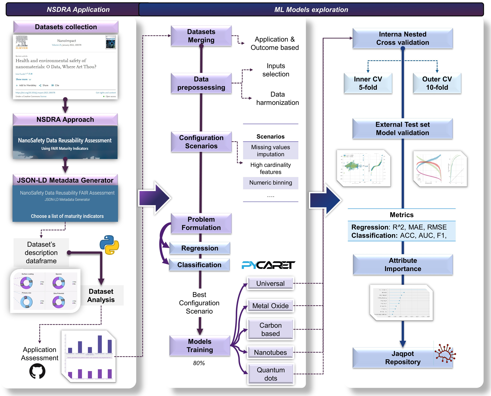

# Exploratory Quantitative Structure Activity Relationships (QSAR) machine learning modeling targeting cellular viability

   

## This work is part of the study titled: A data reusability assessment in the nanosafety domain based on the NSDRA framework followed by an exploratory Quantitative Structure Activity Relationships (QSAR) modeling targeting cellular viability. The other part is [available here](https://github.com/ammar257ammar/Nanosafety-data-reusability-34-datasets).

### Abstract

**Intro:** The current effort towards the digital transformation across multiple scientific domains requires data that is Findable, Accessible, Interoperable and Reusable (FAIR). In addition to the FAIR data, what is required for the application of computational tools, such as Quantitative Structure Activity Relationships (QSARs), is a sufficient data volume and the ability to merge sources into homogeneous digital assets. In the nanosafety domain there is a lack of FAIR  available metadata. 

**Methodology:** To address this challenge, we utilized 34 datasets from the nano-health and environmental safety domain by exploiting the NanoSafety Data Reusability Assessment (NSDRA) framework, which allowed the annotation and assessment of dataset’s reusability. From the framework’s application results, eight datasets targeting the same endpoint (i.e. numerical cellular viability) were selected, processed and merged to test several hypothesis including universal versus nanogroup-specific QSAR models (metal oxide, carbon based, nanotubes, and quantum dots), and regression versus classification Machine Learning (ML) algorithms. 

**Results:** Universal regression and classification QSARs reached an 0.62 R2 and 0.87 accuracy, respectively, for test set. Nanogroup-specific regression models reached 0.91 R2 for nanotubes test set followed by carbon based (0.88), metal oxide (0.7) and quantum dots (0.44). Nanogroup-specific classification models reached 0.93 accuracy for nanotubes test set, followed by carbon-based and metal oxide (0.91), and quantum dots (0.81). The results revealed the need of nanogroup-specific models instead of universal ones. Feature importance revealed different patterns depending on the dataset with common influential features including core size, exposure conditions and toxicological assay.
Even in the case where the available experimental knowledge was merged, the models still failed to correctly predict the outputs of an unseen dataset, revealing the cumbersome conundrum of scientific reproducibility in realistic applications of QSAR for nanosafety. To train better models, data quality, the depth of experimental descriptions and the usage of variables that capture the prediction of cell viability are crucial. 

**Conclusions:** This study reveals that the digitalization of nanosafety knowledge in a reproducible manner has a long way towards its successful pragmatic implementation. The approach carried out in the study shows a promising approach to increase the FAIRness across all the elements of computational studies, from dataset’s annotation to FAIR modelling reporting. This has significant implications for future research as it provides an example of how to utilize and report different tools available in the nanosafety knowledge system, while increasing the transparency of the results. 

### Study Design

